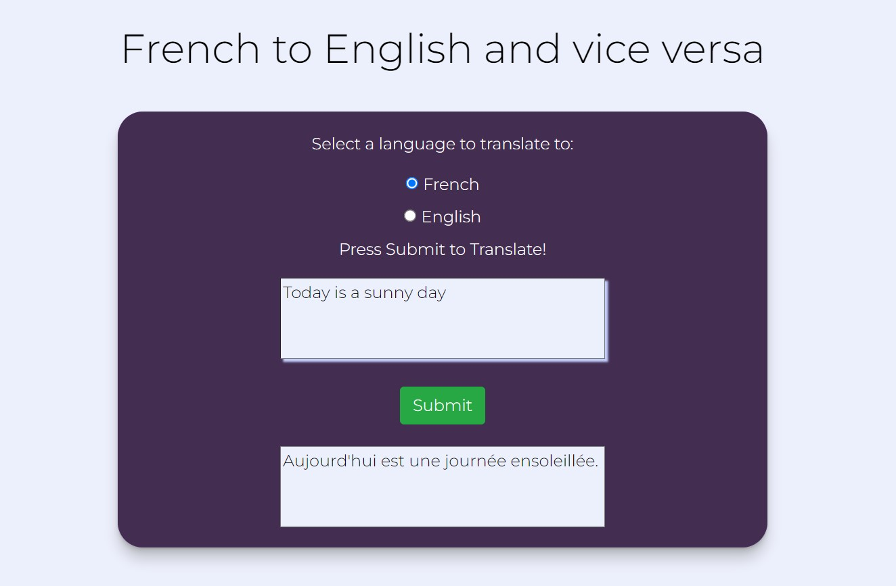

## French Text Translator

<b>Built with</b> 

<b>Completed as part of the Udemy course ‘Code with Node’ by Ian Schoonover.</b>

- The app is a translator that can translate between French and English.
- The MyMemory API is used for translation.

 

